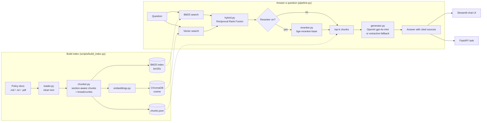

# SellerPolicy Assistant

**Hybrid-search RAG (BM25 + vector + Reciprocal Rank Fusion) that answers Seller Support questions from policy and SOP documents, with citations.**

Built by a former e-commerce Seller Support email associate to solve a problem I faced every shift: finding the *right* policy paragraph fast, and quoting it accurately.

   

## The problem (from the support desk)

A seller email rarely uses the policy's own words:

> *"My buyer says the parcel never showed up and now I got some A2Z thing. How long do I have?"*

To answer it, an associate has to (1) recognise the issue, (2) find the right section among dozens of policy pages, (3) quote exact timelines without guessing, and (4) link the source. Slow searches and misremembered numbers cause wrong replies, repeat contacts and QA defects.

**SellerPolicy Assistant** does steps 2-4 in seconds:

- It **searches two ways at once**: keywords for exact codes ("A-to-z", "SAFE-T", "ODR", "17 days") and *meaning* for casual wording ("parcel never showed up").
- It **fuses** both result lists with Reciprocal Rank Fusion, and can optionally **rerank** them with a cross-encoder.
- It **answers only from the retrieved policy text** and cites every fact as `[1] Policy title § Section`. If the documents don't cover the question, it says *"I couldn't find this in the policy documents."*
- **No API key? It still works.** Extractive mode returns the best policy excerpts with citations.

### Example

```
> python -m scripts.ask "My buyer says the parcel never showed up and now I got some A2Z thing. How long do I have?"

Most relevant policy excerpts:

- A buyer can file a claim when: the item did not arrive within 3 calendar days after the
  maximum estimated delivery date, ... [1]
- A buyer must first contact the seller and wait 48 hours before filing, ... [1]

Sources:
 *[1] A-to-z Guarantee Claims § Eligibility for buyers   (bm25=4 vector=1)
 *[2] A-to-z Guarantee Claims § Response window          (bm25=6 vector=2)
```

BM25 alone ranked the right section 4th; vector search ranked it 1st; the fused result puts it on top.

## Architecture



## Features

- **Section-aware chunking** with breadcrumb headers (`Account Health > Deactivation and Appeals > Appeal timelines`), so every chunk makes sense on its own.
- **BM25 keyword search** (`bm25s`) with a domain-aware tokenizer: keeps `a-to-z`, `safe-t`, `2.5`, `60-day`; normalises `A to Z` / `A2Z` → `a-to-z`.
- **Pluggable embeddings**: local `sentence-transformers` (default), OpenAI `text-embedding-3-small`, or an offline `hashing` embedder for tests and demos.
- **ChromaDB vector store** with our own embeddings, cosine distance and an "index built with which model?" safety check.
- **Hand-written Reciprocal Rank Fusion** with per-method ranks kept for transparency.
- **Optional cross-encoder reranker** (`BAAI/bge-reranker-base`) that falls back to the fused order if the model can't load.
- **Grounded generation**: a strict prompt, `[n]` citations, a "not found" answer, and an **extractive fallback** that needs no API key.
- **Three ways to use it**: CLI scripts, a Streamlit chat UI (shows BM25 rank / vector rank / fused score for every source), and a FastAPI REST API.
- **Evaluation**: 16 hand-labelled questions, Hit@1 / Hit@5 / MRR for BM25 vs vector vs hybrid.
- **93 offline pytest tests**: no internet, no model downloads, no API key needed.

## Evaluation results

16 hand-written questions (`evals/questions.json`): 9 use the policy's own wording ("keyword") and 7 use casual seller wording ("paraphrase"). A hit means a chunk from the expected document **and** section is in the top k.

Embedder: `sentence-transformers/all-MiniLM-L6-v2`, reranker off.

| Mode | Hit@1 | Hit@5 | MRR@5 |
|---|---|---|---|
| BM25 | 0.62 | 0.94 | 0.755 |
| Vector | 0.81 | 1.00 | 0.906 |
| **Hybrid (RRF)** | 0.75 | **1.00** | 0.844 |

| Hit@5 by style | Questions | BM25 | Vector | Hybrid |
|---|---|---|---|---|
| keyword | 9 | 1.00 | 1.00 | 1.00 |
| paraphrase | 7 | 0.86 | 1.00 | **1.00** |

**What this shows:** BM25 is a strong baseline on policy text and finds every keyword-style question, but it misses casual wording (*"parcel never showed up"* → *"did not arrive"*). Semantic embeddings close that gap, and hybrid search reaches 100% Hit@5 on both styles. On this small set, pure vector search ranks slightly higher than hybrid (MRR 0.906 vs 0.844); hybrid is kept as the default because it protects exact-code queries (`SAFE-T`, `A-to-z`) that embeddings can blur. Full per-question ranks are in [`evals/results.md`](evals/results.md).

## Tech stack

| Layer | Tool | Why |
|---|---|---|
| Config | pydantic-settings, python-dotenv | One typed settings object, secrets in `.env` |
| Loading | pypdf | Policy PDFs → text, page-aware |
| Keyword search | bm25s | Fast BM25, saves to disk |
| Embeddings | sentence-transformers (all-MiniLM-L6-v2) / OpenAI | Free local default, paid option |
| Vector store | ChromaDB (persistent) | Local, no server, metadata filters |
| Fusion | Reciprocal Rank Fusion (hand-written) | Combines ranks, not incompatible scores |
| Reranking | Cross-encoder (bge-reranker-base) | Precise second pass on the shortlist |
| LLM | OpenAI Python SDK (gpt-4o-mini) | Cheap, fast, good at following citation rules |
| UI / API | Streamlit, FastAPI, uvicorn | Chat for people, REST for tools |
| Quality | pytest, FastAPI TestClient | Offline tests in a few seconds |
| Deploy | Docker (python:3.12-slim, CPU torch) | One command to run anywhere |

## Quick start (Windows PowerShell)

```powershell
# 1. Create and activate a virtual environment
py -3.12 -m venv .venv
.\.venv\Scripts\Activate.ps1
#    (if blocked: Set-ExecutionPolicy -Scope CurrentUser RemoteSigned)

# 2. Install dependencies (sentence-transformers brings PyTorch, ~1-2 GB)
pip install -r requirements.txt

# 3. Settings: copy the template and paste your OpenAI key (optional)
copy .env.example .env

# 4. Check the environment
python -m scripts.verify_setup

# 5. Build the indexes (first run downloads the ~90 MB embedding model)
python -m scripts.build_index

# 6. Ask questions from the terminal
python -m scripts.ask "How long does a seller have to appeal a deactivation?"
python -m scripts.ask "What is the SAFE-T claim deadline?" --mode bm25
python -m scripts.compare_search "buyer says the parcel never arrived"

# 7. Measure retrieval quality
python -m scripts.evaluate

# 8. Chat UI  ->  http://localhost:8501
streamlit run app/streamlit_app.py

# 9. REST API  ->  http://localhost:8000/docs
uvicorn api.main:app --reload --port 8000

# 10. Tests (offline)
pytest -q
```

**No internet or no model download?** Set `EMBEDDING_PROVIDER=hashing` in `.env`, then run `build_index` again. Everything works offline, with lower semantic quality.

**Windows Smart App Control blocks a scikit-learn DLL?** sentence-transformers cannot import without scikit-learn. The embedder and reranker then fall back to plain `transformers` with the same model (mean pooling + normalisation, identical vectors), so you can `pip uninstall scikit-learn` and carry on.

**Docker:**

```bash
docker build -t sellerpolicy .
docker run -p 8501:8501 --env-file .env sellerpolicy
```

**API example:**

```powershell
Invoke-RestMethod -Method Post -Uri http://localhost:8000/ask -ContentType "application/json" `
  -Body '{"question": "What is the ODR target?", "mode": "hybrid", "top_k": 5}'
```

## How hybrid search and RRF work (in 5 lines)

1. **BM25** ranks chunks by shared keywords. Rare words like "SAFE-T" count more. It's great for codes and numbers but blind to synonyms.
2. **Vector search** ranks chunks by meaning (embedding cosine similarity), so "parcel never showed up" can find "item did not arrive".
3. Their scores are on different scales (7.3 vs 0.62), so we **fuse ranks, not scores**: `RRF(chunk) = Σ 1 / (60 + rank)`.
4. A chunk ranked high by **both** methods beats one ranked first by only one, which helps when the methods disagree.
5. An optional **cross-encoder** re-reads the top 20 together with the question and re-orders them for precision.

See [`sellerpolicy/hybrid.py`](sellerpolicy/hybrid.py) for a worked numeric example, and run `python -m scripts.compare_search` to see the three methods side by side.

## Project structure

```
hybrid-rag-seller-policy/
├── sellerpolicy/              # the Python package
│   ├── config.py              # all settings in one place (.env aware)
│   ├── loader.py              # read + clean .md / .txt / .pdf
│   ├── chunker.py             # section-aware chunking with breadcrumbs
│   ├── bm25_index.py          # tokenizer + BM25 keyword index (bm25s)
│   ├── embeddings.py          # SentenceTransformer / OpenAI / Hashing embedders
│   ├── vector_store.py        # ChromaDB persistent vector index
│   ├── hybrid.py              # Reciprocal Rank Fusion (hand-written)
│   ├── reranker.py            # optional cross-encoder reranker
│   ├── prompts.py             # LLM system + user prompts
│   ├── generator.py           # OpenAI answer + extractive fallback
│   ├── results.py             # RetrievedChunk / Answer data classes
│   └── pipeline.py            # SellerPolicyRAG: build_index / retrieve / answer
├── scripts/
│   ├── verify_setup.py        # environment checklist
│   ├── inspect_chunks.py      # look at your chunks
│   ├── build_index.py         # build BM25 + vector indexes (--data-dir)
│   ├── ask.py                 # ask one question from the terminal
│   ├── compare_search.py      # BM25 vs vector vs hybrid, side by side
│   └── evaluate.py            # Hit@k + MRR → evals/results.md
├── app/streamlit_app.py       # chat UI
├── api/main.py                # FastAPI: POST /ask, GET /health
├── data/
│   ├── policies/              # 7 synthetic seller policy + SOP documents
│   └── banking_sample/        # 1 synthetic bank policy (domain-swap demo)
├── evals/
│   ├── questions.json         # 16 labelled test questions
│   └── results.md             # latest evaluation output
├── tests/                     # 93 offline pytest tests
├── storage/                   # built indexes (git-ignored)
├── Dockerfile
├── requirements.txt
├── .env.example
├── README.md
└── LEARN.md                   # step-by-step learning path through the code
```

## Use with banking documents

Nothing in the pipeline is specific to e-commerce. It works on **any** policy library with headings: bank policies, insurance SOPs, HR handbooks.

1. Put the policy files (`.pdf`, `.md` or `.txt`) in a folder, e.g. `data/banking/`.
2. Build the index from that folder:

   ```powershell
   python -m scripts.build_index --data-dir data/banking_sample
   python -m scripts.ask "How soon must I report an unauthorised debit card transaction?"
   ```

3. PDFs are split page by page (`## Page N`) so citations read `Policy title § Page 4`.

`data/banking_sample/` contains one synthetic *Debit Card Transaction Dispute Policy* to try this. Rebuilding replaces the current index, so run `python -m scripts.build_index` (no flag) to switch back to the seller policies. To keep both, set `DATA_DIR` and `STORAGE_DIR` per domain in `.env`. Scanned (image-only) PDFs need OCR first.

## Configuration

All settings live in `sellerpolicy/config.py` and can be overridden in `.env`:

| Variable | Default | Meaning |
|---|---|---|
| `OPENAI_API_KEY` | none | Enables LLM answers; without it → extractive mode |
| `EMBEDDING_PROVIDER` | `sentence-transformers` | `sentence-transformers` \| `openai` \| `hashing` |
| `USE_RERANKER` | `false` | Cross-encoder rerank of the top `CANDIDATE_K` |
| `TOP_K` / `CANDIDATE_K` | `5` / `20` | Final sources / candidates per method before fusion |
| `RRF_K` | `60` | RRF constant |
| `LLM_MODEL` | `gpt-4o-mini` | Chat model |
| `CHUNK_MAX_CHARS` / `CHUNK_OVERLAP_CHARS` | `1000` / `150` | Chunking |

## Data disclaimer

All documents in `data/` are **synthetic**, written for this portfolio project. They imitate how marketplace and bank policies are *structured*, but they are **not official Amazon policies, not internal Amazon or vendor documents, and not the policy of any bank**. All numbers are illustrative.
